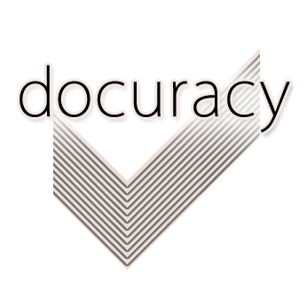

    

# ***Locolligo***: Historical Geodata Curator
(**Latin**: *loco\[s co\]lligo* &#8776; 'I link places')

    

***Locolligo* is a single-page, browser-based javascript application \[*in the early stages of development*\] for the formatting, linking, and geolocation of datasets, with a particular focus on Cultural Heritage.** The greatest barrier to the visualisation, sharing, and linking of datasets that have a locational facet is the variety of ways and formats in which information has been collected, recorded, and stored. *Locolligo* seeks to dissolve that barrier.

This software originated as an output of the AHRC-funded [**Locating a National Collection**](https://www.nationalcollection.org.uk/Foundation-Projects#:~:text=Locating%20a%20National%20Collection) (LaNC) project. Based at the British Library in London, the project was part of the AHRC programme [Towards a National Collection: Opening UK Heritage to the World](https://www.nationalcollection.org.uk/). *Locolligo* addresses the LaNC project's aim of helping cultural heritage organisations to use geospatial data, and together with development of *Peripleo* is a major step in scoping 'technical recommendations for the development of a national discovery system whereby objects about a topic of interest can be readily discovered from a variety of sources, represented in the context of their historic environment, and referenced in time and landscape'. 

*Locolligo* employs standards developed by the [Pelagios Network](https://pelagios.org/), and will (for example) conform datasets for use in the Network's [*Peripleo*](https://github.com/britishlibrary/peripleo) map visualisation and [*Recogito*](https://recogito.pelagios.org/) annotation software, and generate metadata for the submission of datasets to the Network's historical geodata Registry. It can be downloaded and run on a standalone PC, tablet, or smartphone, without any dependency on a database or other server infrastructure; basic features will even run without an internet connection.

>It facilitates the linking of related records (*subjects* and *objects*) based on definable criteria (*predicates*):
>* between datasets, 
>* to points within existing gazetteers of places-names, and
>* to coordinates picked on modern or historical maps.
>
>The [knowledge graphs](https://en.wikipedia.org/wiki/Knowledge_graph) (collections of [semantic triples](https://en.wikipedia.org/wiki/Semantic_triple) which are the basis of [RDF](https://en.wikipedia.org/wiki/Resource_Description_Framework)) thereby created will enable the automated discovery (within a [knowledge base](https://en.wikipedia.org/wiki/Knowledge_base)) of further links between data records.

## What Next?
Because *Locolligo* runs in the browser, no installation is necessary, but you are encouraged to read the User Guides before heading to https://docuracy.github.io/Locolligo/.
* [Basic User Guide](./User-Guide-Basic.md)
* [Advanced User Guide](./User-Guide-Advanced.md)
* [Use Locolligo](https://docuracy.github.io/Locolligo/)

---

## Key Features:
- [x] Convert CSV to JSON (extended Linked Places Format)
- [x] Conform geodata to [WGS84](https://en.wikipedia.org/wiki/World_Geodetic_System) from:
    - [x] [OSGB](https://en.wikipedia.org/wiki/Ordnance_Survey_National_Grid) (Ordnance Survey of Great Britain)
    - [x] [EPSG:29900](https://en.wikipedia.org/wiki/Irish_grid_reference_system) (Irish Grid Eastings & Northings)
- [x] Standardisation of annotation fragment selectors (see [here](https://github.com/docuracy/LaNC/blob/main/Peripleo_Fragment_Selector_SVG.js)). Useful for display of IIIF fragments.
- [x] Implementation of [schema.org](https://schema.org/) vocabulary to facilitate dataset indexing and discovery.
- [x] Fetch CITATION.cff and incorporate in dataset as CSL-JSON.
- [x] Facilitate editing of dataset metadata.
- [x] Add converted datasets to user's local **GeoData Library** ([indexedDB](https://developer.mozilla.org/en-US/docs/Web/API/IndexedDB_API) store).
- [x] Find places in map view (using GeoNames API).
- [x] Data Linking
    - [x] Curated interlinking of datasets (using **GeoData Library**)
    - [x] Programmatic linking of Wikidata settlements (best text match within 15km, using Levenshtein algorithm).
    - [x] Cultural Heritage sites within radius: [Wikidata](https://www.wikidata.org/).
    - [x] [GeoNames toponyms](https://www.geonames.org/export/web-services.html#findNearby).
    - [x] [World Historical Gazetteer](https://whgazetteer.org/usingapi/).
    - [x] Wikipedia articles: [GeoNames API](https://www.geonames.org/export/wikipedia-webservice.html#findNearbyWikipedia).
    - [x] Archaeological finds within radius: [PAS](https://finds.org.uk/) API.
    - [x] Historical Plaques: [OpenPlaques.org](https://openplaques.org/) API.
    - [x] Geograph photographs: [Geograph Syndicator API](https://www.geograph.org.uk/help/api#rss)..
- [x] Geocoding of place-names (Geonames).
- [x] URLs and Persistent IDs (PIDs)
    - [x] Generate UUIDs and corresponding PIDs for datasets (and each of their items), when converted from delimited text.
    - [x] Static gazetteer [example](https://docuracy.github.io/Locolligo/datasets/#Hollar-1660/d54e04cd-c73e-4f21-8b71-8d69aaada6fe).
    - [x] Integration with w3id.org to form PIDs to reach gazetteer: [example](https://w3id.org/locolligo/Hollar-1660/d54e04cd-c73e-4f21-8b71-8d69aaada6fe)
- [x] Geocoding of un-gazetteered places
    - [x] Create or adjust feature coordinates with reference to basemap.
    - [x] Use georeferenced historical basemaps as citable references.
- [ ] [Pelagios Registry](https://pelagios.org/activities/registry/) metadata generation
- [ ] Recogito meta-gazetteer generation

## Limitations
Dataset size is limited by local device memory, although a PC with 16GB of memory easily copes with 25,000 records in a 12-field csv input file. It may be possible to implement chunking if necessary for larger files. Memory use is mitigated by use of a spatially-indexed IndexedDB store for a local GeoData Library.

## Acknowledgements
Much of the functionality of this software is provided through the use of pre-existing JavaScript libraries, notably the following:

* **JQuery** simplifies cross-browser implementation of HTML document traversal and manipulation, event handling, animation, and Ajax: https://jquery.com/
* **Papa Parse** is 'the first (and so far only) multi-threaded CSV parser', for converting between delimited text and JSON: https://www.papaparse.com/
* **JSON Formatter** renders JSON objects in HTML with a collapsible navigation: https://azimi.me/json-formatter-js/
* **UUIDJS** generates RFC-compliant [Universally Unique IDentifiers](https://en.wikipedia.org/wiki/Universally_unique_identifier) (UUIDs) in JavaScript: https://github.com/uuidjs/uuid
* **Movable Type Scripts** convert between latitude/longitude & OS National Grid References: https://www.movable-type.co.uk/scripts/latlong-os-gridref.html
* **Proj4js** transforms point coordinates from one system to another: https://github.com/proj4js/proj4js
* **shp2geojson.js** converts zipped shapefiles to geoJSON: https://github.com/gipong/shp2geojson.js
* **Citation.js** fetches citation data from a CITATION.cff file and converts it to CSL-JSON: https://github.com/citation-js

## Licence
All original work within this software is offered under the terms of the **CC-BY 4.0 International** licence detailed [here](./LICENSE.md).

## Suggestions / Contact
Please tag [@docuracy](https://twitter.com/docuracy) on Twitter, using the hashtags **#BL_LaNC** and **#Locolligo**
