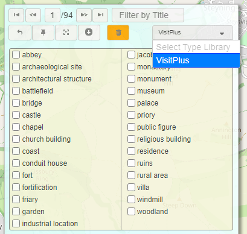

    

# Advanced User Guide
> This User Guide will take you through the steps required to link features in a location-based dataset to other web-resources, ready for visualisation in *Peripleo*,  and it assumes that you are already familiar with the processes discussed in the [Basic User Guide](./User-Guide-Basic.md). It is based on the initial configuration set up in the [master repository](https://github.com/docuracy/Locolligo), as outlined [below](./User-Guide-Advanced.md#configuration). If you want to customise the configuration, you will need to either 'fork' the repository into your own GitHub account or host the software elsewhere.

## Load Example Dataset
1. Point your browser to https://docuracy.github.io/Locolligo/ (*right-click this link to avoid losing your place in this Guide*).
2. Click on `Choose Input`, then 
3. `Try Example`, and 
4. Select `Hollar-1660.lp.json` from the drop-down list.

You can explore this ready-made file (in Linked Places Format) by clicking on the triangular icons to expand and collapse the various 'object' properties.

## Clear Dataset
Click on `Clear` at any time to reload *Locolligo*. Any dataset that you have been working on will be lost unless you first download it.

## Local GeoData Library
Any dataset (once converted to Linked Places Format) can be saved to your browser's internal storage ([IndexedDB](https://developer.mozilla.org/en-US/docs/Web/API/IndexedDB_API)), ready to be linked to other datasets.
### Add to Library
1. Click on `Library`, then 
2. Type a name for your dataset, and then 
3. Click on `Update Library`.
### Link to Library
Automatically link all features in the currently-loaded dataset to features in a selected GeoData Library dataset, based on configurable combinations of geographical distance and textual similarity.
 
> *The default configuration might not suit your dataset: for best results copy the software to your own GitHub repository and edit the `/templates/libraryMappings.json` configuration file.*

1. Click on `Library`, then 
2. Select the radio button next to the name of the dataset to which you wish to create links, and then
3. Click on `Link to Library`.
### Delete from Library
1. Click on `Library`, then 
2. Click on the bin icon next to the name of the dataset you wish to delete.

## Upload Linked Places Format (LPF) file
If you already have a file in Linked Places Format, you can simply upload it and begin work on it. Click on `Choose Input`, then on `Upload`, and follow the usual steps for locating a file on your device.

## Convert CSV to Linked Places Format (LPF)
> See the [Basic User Guide](./User-Guide-Basic.md) for details of how to upload CSV (tabular data) and open the `Assign CSV Columns` form. This Guide deals with more detailed configuration.
> 
> **Documentation yet to be written.**

## Geolocate Place-Names
> **Documentation yet to be written.**
> 
> **API Key needs to be set for [Named Entity Recognition (NER)](https://en.wikipedia.org/wiki/Named-entity_recognition) of place-names in text blocks using the [Google Natural Language API](https://cloud.google.com/natural-language/docs/reference/rest/v1/documents/analyzeEntities)**.

## Annotate CSV Column Headers and Upload `.lp.csv`
> **Documentation yet to be written.**

## Manually Link & Georeference Dataset
1. Click on `Link/Georeference`.
2. A JSON object representing the first feature in your dataset is loaded into the Feature Explorer overlay.
3. If it already has coordinates, the first feature in your dataset is shown on the map.
4. Navigate around your dataset by one of the following methods:
    1. Use the left/right arrow buttons in the Feature Explorer, or
    2. Type some text into the `Filter by Title` box, or
    3. Drag and zoom the map and click on a feature of interest.
5. A download button is provided (a down arrow) which replicated the functionality described [below](./User-Guide.md#download-dataset).
6. The orange bin button will delete the current feature: use with caution as this action cannot be undone.
7. The back-arrow button will revert recent changes made to the current feature; the edit history is lost if you switch to another feature.
8. The magnifying glass button can be used to search a modern gazetteer (GeoNames) for places *within the current map view*.
9. The layers button reveals lists of configured APIs and GeoData Library datasets to which you can link the current feature: results for checked items are refreshed as you move from one feature to another. *Requirements for remote APIs are prone to change, and if the system seems unresponsive you are advised to check your browser's console for Network response data (press [F12]).*
10. If you recentre the map you can simply tap on the layers button to refresh API data based on the current map centre point.
11. Linkable features are indicated by markers on the map:
    1. Hover over a marker for a preview of the feature.
    2. Click on a marker for more details of the feature.
    3. Click `Link Only` to link the feature to your current dataset feature.
    4. Click on `Link and Move` to additionally move the coordinates of your current dataset feature to those of the linkable feature.

## Automatically Link Dataset via APIs
> **Need to set API Key**
The API buttons are used to programmatically link all dataset features to remote web resources, based on configurable combinations of geographical distance and textual similarity. API calls are throttled to respect providers' usage limits. The preconfigured APIs are:
- `WD`: [Wikidata](https://www.wikidata.org/wiki/Wikidata:Main_Page) ('a free and open knowledge base that can be read and edited by both humans and machines').
- `GG`: [Geograph](https://m.geograph.org.uk/) ('geographically representative photographs and information for every square kilometre of Great Britain and Ireland').
- `WP`: Wikipedia articles linked by [GeoNames](https://www.geonames.org/export/wikipedia-webservice.html).
- `PAS`: [Portable Antiquities Scheme](https://finds.org.uk/) (archaeological finds in England and Wales).

## Link to Vocabularies

You can link records to one or more definitions in external vocabularies, such as Wikidata, [Getty](http://vocab.getty.edu/), or [PeriodO](https://perio.do/). Look at the `VisitPlus.csv` example in the `types` folder, which is available in the *Locolligo* feature editor as illustrated here.

To add your own vocabularies simply upload `.csv` files to the `types` folder. The name of the file is used in the drop-down list. Your file should have the words `label,identifer` on the first line, followed by comma-separated pairs of labels and identifiers such as `windmill,wd:Q38720`, `specialty software,http://vocab.getty.edu/aat/300433489`.

Any labels selected in the Type Library will be added to the current feature in its list of `types`. These `types` are used by computers for establishing links between data records, and serve as filters in the *Peripleo* mapping software.

## Download Dataset
There are two options for 'downloading' your dataset to your local filesystem (although in fact it is already held and processed locally in your device's memory):
1. Click on `Download` to save the file in JSON format.
2. Click on `CSV` to convert your dataset to CSV format (Comma Separated Values, as used by spreadsheet software). *Note that every JSON property that has a value will be assigned its own column. The column headers will be formatted in such a way that the file can be converted back to LPF JSON by reimporting it.*

## JSON Editing
There is basic support for editing the JSON objects displayed in *Locolligo*: hover over a property's name to reveal a clickable bin for its deletion, or over a property's value to reveal a clickable pencil for editing mode. For more complex editing or additions to the object structure, you should download the dataset and use a dedicated JSON editor: try [Notepad++](https://notepad-plus-plus.org/) with its JSON Viewer plugin. After editing, you can simply upload your dataset back into *Locolligo*.

## Configuration
Much of the configuration is determined by the files listed below, which can easily be edited if you have your own copy of the master repository. More complex configuration can be achieved by editing the main JavaScript file ([data-converter.js](./js/data-converter.js)), which includes many now-disabled sections of code used during development that might be customised and re-deployed.
- [APIs.json](./templates/APIs.json): configuration of external APIs used to gather linked data.
- [API-keys.js](./API-keys.js): configuration of API keys.
- [indexing.json](./templates/indexing.json): template for schema.org-compliant description of the dataset.
- [libraryMappings.json](./templates/libraryMappings.json): configuration of linkage to locally-stored [Geodata Library](./User-Guide.md#local-geodata-library) items.
- [mappings.json](./templates/mappings.json): used during development to define JSONata transformation expressions, now largely redundant.
